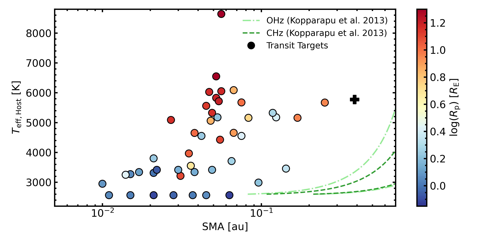

# JWST Target Visualisation
Small routines to plot target parameters of JWST observational cycles.

- `targets_cycle1.py`: Plots parameters of Cycle 1 transit spectroscopy targets, based on a personal list I created.
- `schedule_cycle1.py`: Plots scheduled observations for filtered cycle 1 target list.

Exemplary output for Cycle 1 targets: 
- SMA distance (AU) against host star effective temperature
- Kopparapu et al. (2013) habitable zone distance for reference
- Marker colour-mapped by planetary radius

Example for cycle 1 schedule: All **Transit** targets with **Rp < 4 Re** and **no EAP**

Additional: `spectrum_conversion` can take care of formatting *Eureka!* spectra into a TauREx3 readable format.
