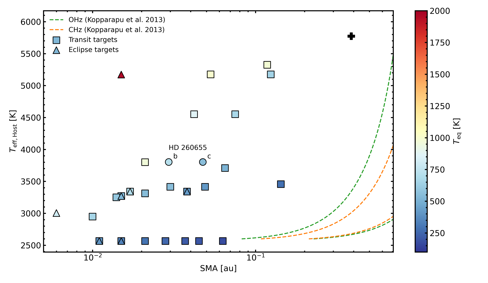

# JWST Target Visualisation
Small routines to plot target parameters of JWST observational cycles.

- `targets_cycle1.py`: Plots parameters of Cycle 1 planetary targets in  super-Earth to mini-Neptune range.

Exemplary output for Cycle 1 targets: 
- SMA distance (AU) against host star effective temperature
- Kopparapu et al. (2013) habitable zone distance for reference
- Marker size scaled by planetary radius (see legend)

Additional: `spectrum_conversion` can take care of formatting *Eureka!* spectra into a TauREx3 readable format.
