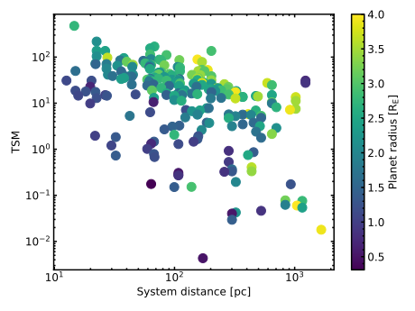

# JWST Target Visualisation
Small routines to plot target parameters of JWST observational cycles.

- `target_parameters.py`: Plots parameters of JWST planetary targets for 
Transmission and Emission spectroscopy (based on the lists I have created). 
Queries the  NASA Exoplanet Archive DB to get most up-to-date parameters.

- `target_schedule.py`: Plots the expected individual observations 
(potentially filtered by e.g. planetary radius).

- `target_spectroscopy-metric.py`: Queries the NASA Exoplanet Archive (LINK)
 with user-defined constraints, and calculates the TSM-value from Kempton 
  et al. (2018) (ESM-value is TBD), and compares it to targets in JWST 
  Cycle 1 and 2, as well as in the ARIEL Tier 2 target list.

Exemplary output: 
- SMA distance (AU) against host star effective temperature
- Marker colour-mapped by planetary radius


Exemplary output for Cycle 1 schedule: Individual observations of transit
targets (current date marked by vertical dashed line)


Exemplary output of TSM evaluation: Results are saved in the `tsm_table.csv`,
```
          pl_name  pl_rade  pl_masse  pl_orbsmax  pl_eqt  ...   td_perc  sig_prim_ppm  sig_seco_ppm  ARIEL  JWST
55      GJ 1214 b    2.742      8.17     0.01490   596.0  ...  1.432963        1907.0         153.0   True  True
535    LHS 1140 b    1.635      6.38     0.09570   378.9  ...  0.509490         329.0          26.0    NaN  True
142     GJ 3090 b    2.130      3.34     0.03165   693.0  ...  0.141023         415.0          33.0   True  True
3076    TOI-270 d    2.133      4.78     0.07210   387.0  ...  0.264821         304.0          24.0   True  True
523     TOI-270 c    2.355      6.15     0.04526   488.0  ...  0.322815         401.0          32.0   True   NaN
515   LP 791-18 c    2.438      7.10     0.02961   324.4  ...  1.541917        1143.0          91.0   True   NaN
442    TOI-1231 b    3.650     15.40     0.12880   329.6  ...  0.486006         253.0          20.0   True  True
758    TOI-1201 b    2.415      6.28     0.02870   703.0  ...  0.188466         339.0          27.0    NaN   NaN
53     TOI-1759 b    3.140     10.80     0.11770   443.0  ...  0.230195         197.0          16.0   True   NaN
141    TOI-1416 b    1.620      3.48     0.01900  1517.0  ...  0.035344         166.0          13.0    NaN   NaN
547     TOI-178 d    2.572      3.01     0.05920   690.0  ...  0.131599         516.0          41.0   True   NaN
437     TOI-178 g    2.870      3.94     0.12750   470.0  ...  0.163861         373.0          30.0   True   NaN
158   Kepler-37 d    2.030      2.00     0.21090   499.0  ...  0.055498         187.0          15.0    NaN   NaN
412    TOI-1064 c    2.651      2.50     0.09429   634.0  ...  0.110844         496.0          40.0   True   NaN
62      TOI-421 b    2.680      7.17     0.05600   981.4  ...  0.079757         195.0          16.0    NaN  True
123     TOI-969 b    2.765      9.10     0.02636   941.0  ...  0.143146         272.0          22.0    NaN   NaN
527     TOI-561 c    2.910      5.39     0.08840   800.0  ...  0.100871         290.0          23.0   True   NaN
667       K2-36 c    3.200      7.90     0.05528   854.0  ...  0.166025         382.0          31.0    NaN   NaN
218    TOI-1422 b    3.960      9.00     0.10800   867.0  ...  0.126686         321.0          26.0   True   NaN
213    TOI-1246 d    3.510      5.30     0.13100   586.0  ...  0.140009         361.0          29.0   True   NaN

```
Some preliminary parameters are plotted as well,

