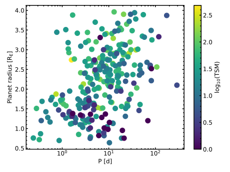

# JWST Target Visualisation
Small routines to plot target parameters of JWST observational cycles.

- `target_parameters.py`: Plots parameters of JWST planetary targets for 
Transmission and Emission spectroscopy (based on the lists I have created). 
Queries the  NASA Exoplanet Archive DB to get most up-to-date parameters.

- `target_schedule.py`: Plots the expected individual observations 
(potentially filtered by e.g. planetary radius).

- `target_spectroscopy-metric.py`: Queries the NASA Exoplanet Archive (LINK)
 with user-defined constraints, and calculates the TSM-value from Kempton 
  et al. (2018) (ESM-value is TBD), and compares it to targets in JWST 
  Cycle 1 and 2, as well as in the ARIEL Tier 2 target list.

Exemplary output: 
- SMA distance (AU) against host star effective temperature
- Marker colour-mapped by planetary radius


Exemplary output for Cycle 1 schedule: Individual observations of transit
targets (current date marked by vertical dashed line)


Exemplary output of TSM evaluation: Results are saved in the `tsm_table.csv`,
```
         pl_name  pl_rade    TSM st_spectype  sy_jmag   td_perc ARIEL  JWST
66     GJ 1214 b    2.742  482.0        M4 V    9.750  1.432963  True  True
622  HD 219134 b    1.602  292.0                3.981  0.035455   NaN   NaN
554     55 Cnc e    1.875  255.0                4.768  0.033441  True  True
544  HD 136352 c    2.916  234.0                4.308  0.063607  True   NaN
73   HD 191939 d    2.995  227.0        G9 V    7.597  0.085325  True   NaN
172    GJ 3090 b    2.130  217.0        M2 V    8.168  0.141023  True  True
513  HD 219134 c    1.511  205.0                3.981  0.031541   NaN   NaN
814  HD 260655 c    1.533  196.0        M0 V    6.674  0.102028  True   NaN
823    TOI-431 d    3.290  189.0                7.305  0.170720  True   NaN
460   TOI-1064 c    2.651  169.0                9.097  0.110844  True   NaN
607    TOI-178 d    2.572  155.0           K    9.372  0.131599  True   NaN
71   HD 191939 b    3.410  153.0        G9 V    7.597  0.110609  True   NaN
183  HD 207496 b    2.250  143.0      K2.5 V    6.570  0.071767   NaN   NaN
368    GJ 9827 d    2.022  141.0                7.984  0.095455  True  True
256   HIP 9618 b    3.900  139.0                7.922  0.135870   NaN   NaN
583    TOI-270 c    2.355  137.0           M    9.099  0.322815  True   NaN
33    HD 73583 b    2.790  136.0        K4 V    7.649  0.154853  True   NaN
263     K2-138 f    2.904  136.0               10.756  0.095837  True   NaN
113  HD 136352 b    1.664  136.0                4.308  0.020713   NaN   NaN
580  HD 136352 d    2.562  127.0                4.308  0.049100   NaN   NaN

```
Some preliminary parameters are plotted as well (on the left, system 
distance against TSM value, colour-coded by planet radius; on the right, 
planet radius against orbital period, colour-coded by TSM value):


<p align="center">


</p>

Finally, I also added an optional plot of individual systems in the 
mass-radius parameter space, to get an idea of the planet composition. Some 
example-plots are shown below. I included some iso-density contours from 
[Zeng et al. (2016)](https://iopscience.iop.org/article/10.3847/0004-637X/819/2/127) 
(as I have seen done in other paper), as well as the uncertainties give in the 
data set from the NASA EPA).

<p align="center">


</p>

